# LeafChat (Frontend)

<p align="center">
  
</p>

## Overview

LeafChat is full-stack messenger application designed to provide seamless communication, built as part of The Odin Project curriculum.

## [Live Demo](https://leafchat-frontend.onrender.com)

Deployed on [Render](https://render.com/).

### Built With

<a href="https://reactjs.org">
  
</a>
<a href="https://vitejs.dev">
  
</a>
<a href="https://react-query.tanstack.com">
  
</a>
<a href="https://reactrouter.com">
  
</a>
<a href="https://daisyui.com">
  
</a>
<a href="https://tailwindcss.com">
  
</a>
<a href="https://socket.io">
  
</a>
<a href="https://react-hook-form.com" >
  
</a>
<a href="https://zod.dev/">
  
</a>

## Features

- **Real-time Messaging**: Private and group chat rooms with instant updates via WebSockets.
- **Group Chats**: Users can create group chats, add multiple friends to the conversation and assign group admins.
- **User Profile**: Customizable profiles, including interesting usage statistics.
- **Contacts List**: Users can create private chat conversation from a global contacts list.
- **Authentication**: Custom user authentication with Email and password based on JWT.
- **Responsive UI**: Modern, mobile-friendly interface with dark mode support.
- Optimistic updates on group creating, profile updating, contact adding and so on.

## Getting started

### 1. Clone the Repository

#### HTTPS

```bash
$ git clone https://github.com/amit-amsl/messaging-app-frontend.git
```

#### SSH

```bash
$ git clone git@github.com:amit-amsl/messaging-app-frontend.git
```

### 2. Install dependencies

```bash
cd messaging-app-frontend
npm install
```

### 3. Setup environment variables

Create a .env file in the root directory of the project and add the following variables. Adjust the values according to your environment:

```bash
VITE_APP_API_URL=<URL_of_the_Server_running_the_backend> # (Example: http://localhost:3000/api)
VITE_APP_SOCKET_URL=<Simple_URL_of_the_Server_running_the_backend> # (Example: localhost:3000)
```

### 4. Start development server

```bash
npm run dev
```

The application will be available at http://localhost:5173 by default.
Have fun!

## Tech Stack

- **React**: A JavaScript library for building user interfaces.
- **Vite**: Next generation frontend tooling.
- **TypeScript**: Typed superset of JavaScript.
- **TailwindCSS**: Utility-first CSS framework.
- **DaisyUI**: A popular Tailwind CSS plugin that offers a range of pre-made, editable UI elements
- **Tanstack Query** (aka React-Query): Powerful library designed to simplify data fetching and state management in web applications.
- **Axios**: A popular library used for making HTTP requests.
- **Socket.IO-Client**: Library that enables low-latency, bidirectional and event-based communication between a client and a server.
- **React-Hook-Form**: Library for building and managing forms in React applications.
- **Zod**: A TypeScript-first schema declaration and validation library.
- **Zustand**: Small, fast, and scalable state management library for React applications
- **Lucide React**: Icon library for React.
- **date-fns**: Utility library designed for manipulating and formatting dates.
- **React-Select**: Flexible and beautiful Select Input control for ReactJS with multiselect, autocomplete, async and creatable support.
- **@hookform/resolvers**: Provides integrations with various validation libraries like Yup, Zod, and Joi, allowing you to use them with React Hook Form for form validation

## Screenshots

### Desktop

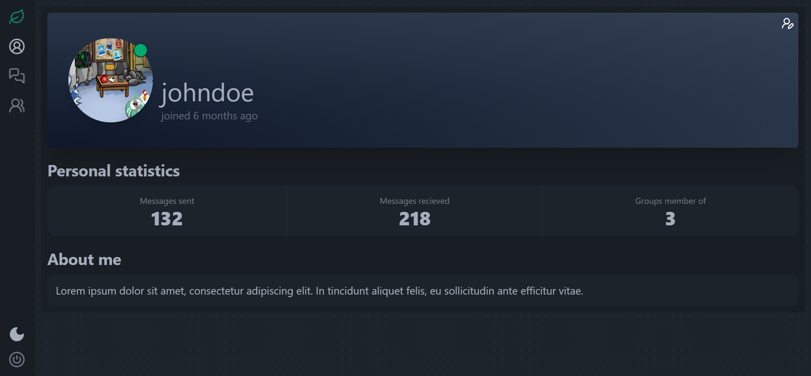

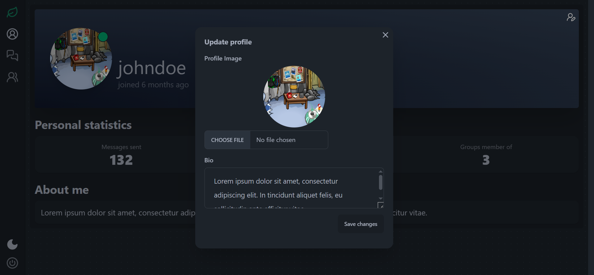

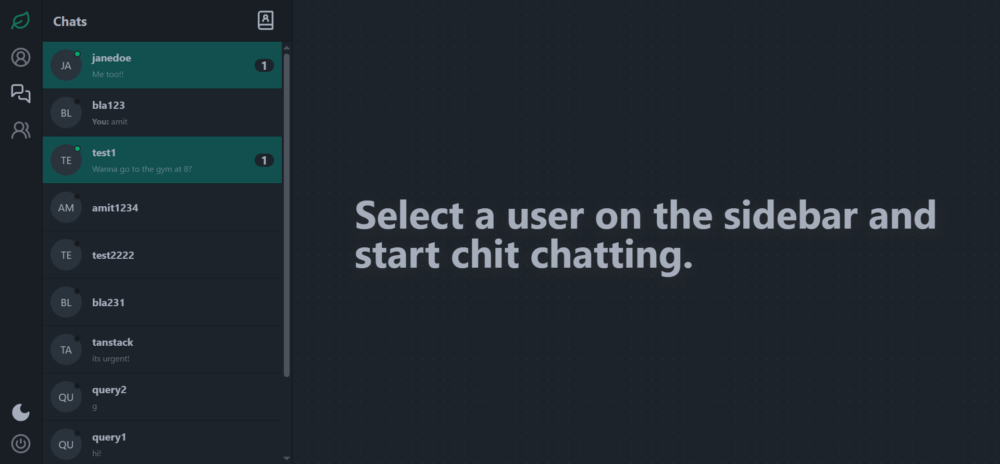

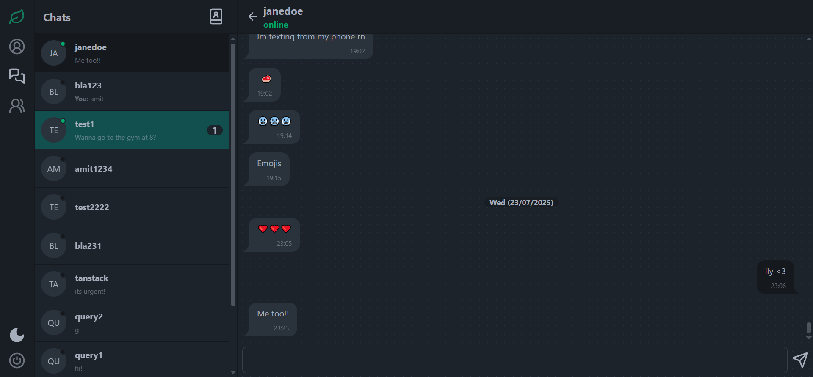

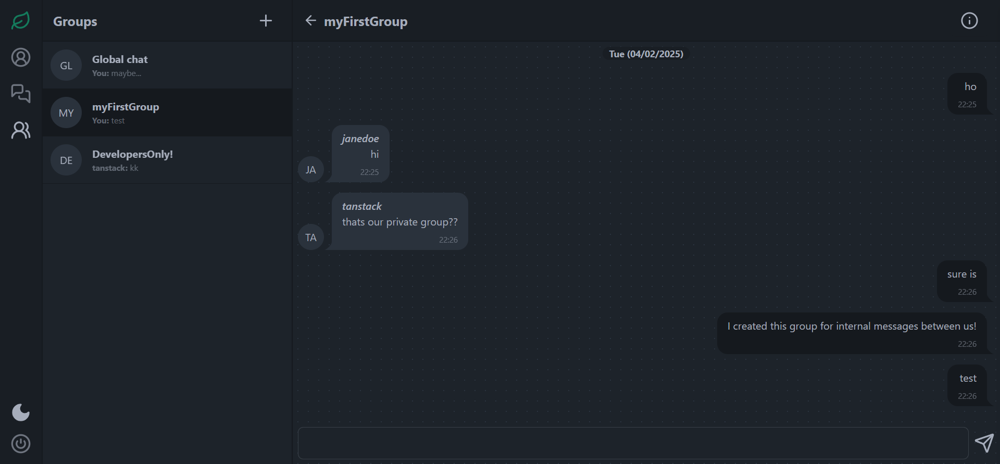

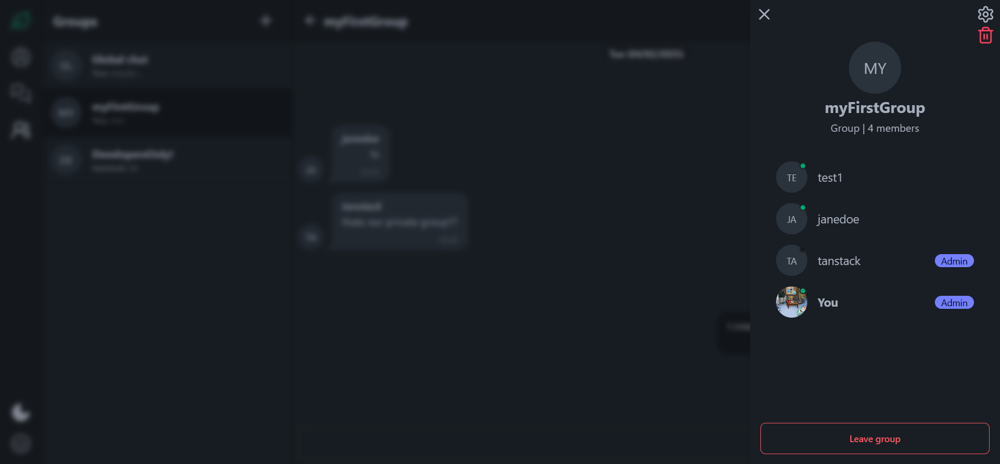

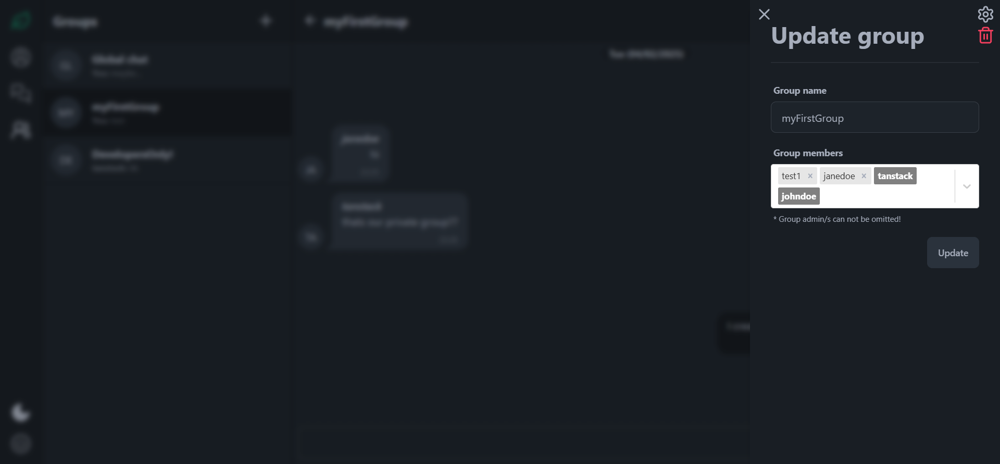

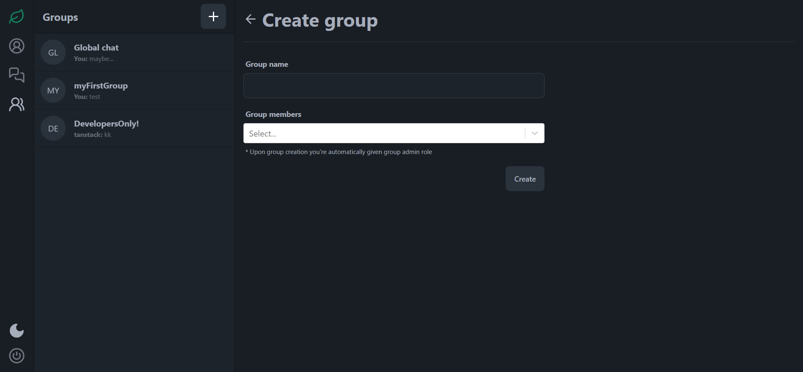

### Mobile

<div style="display: flex; flex-wrap: wrap; gap: 4px; align-items: flex-start;">
  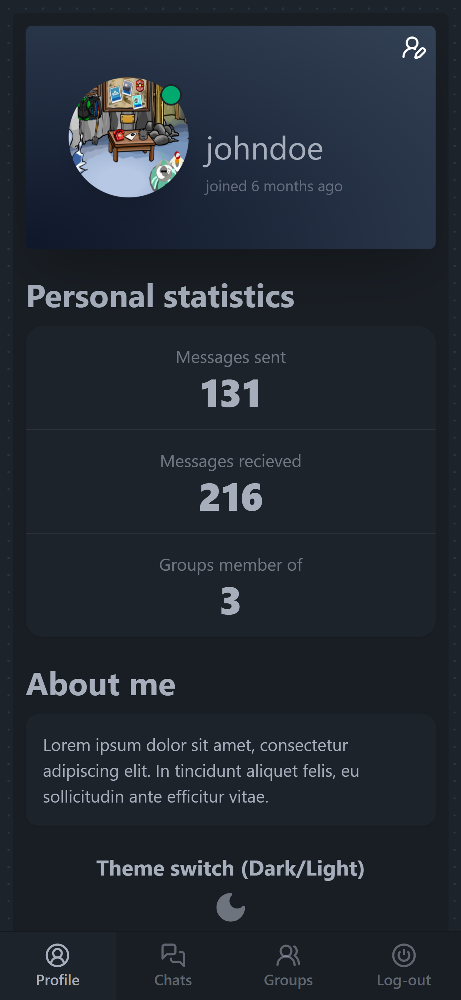
  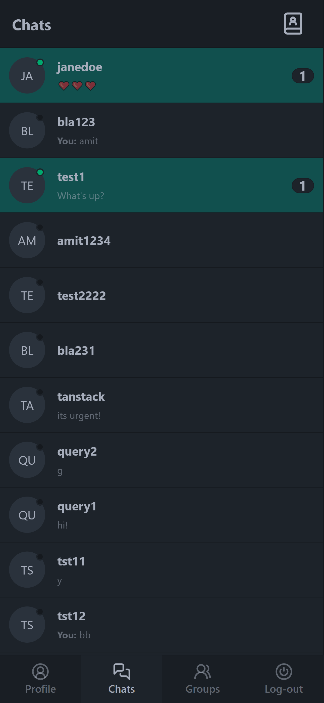
  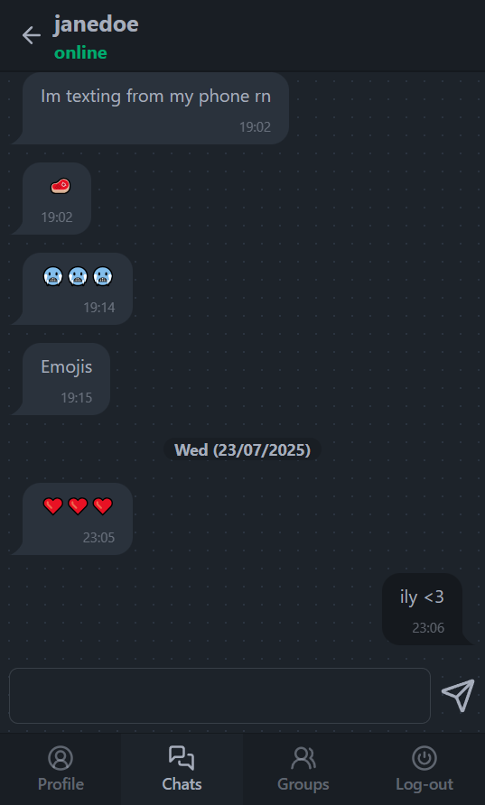
  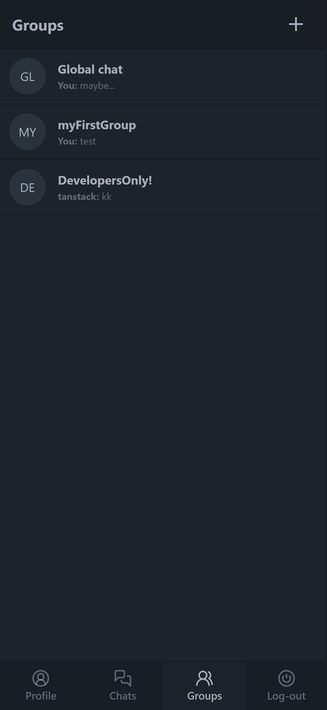
  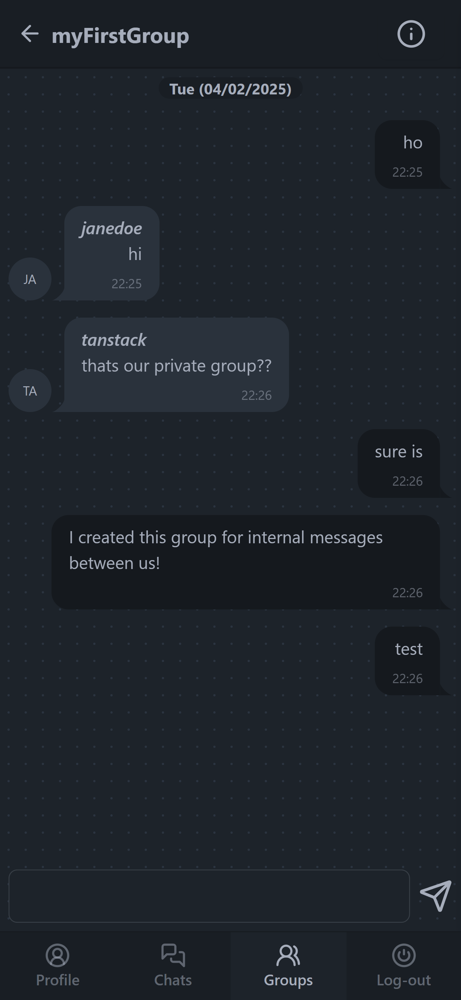
  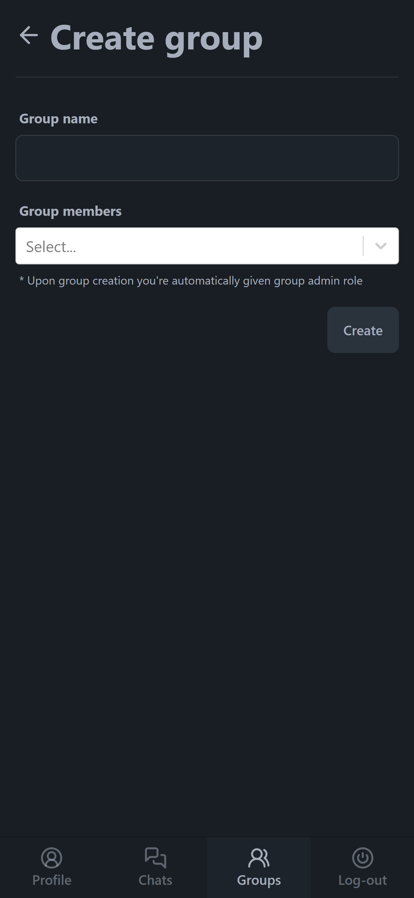
</div>

## Contributing:

Feel free to fork the repository and submit pull requests. Any contributions, whether they’re bug fixes, new features, or performance improvements, are always welcome.

## Disclaimer:

This project is built for educational purposes only. Any resemblance to actual social media platforms, living or dead, is purely coincidental.
